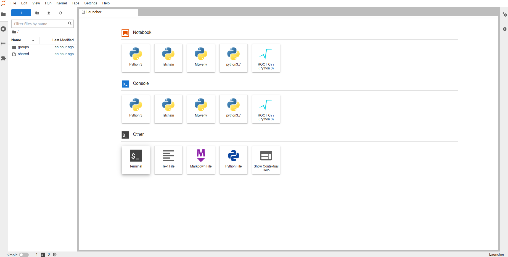
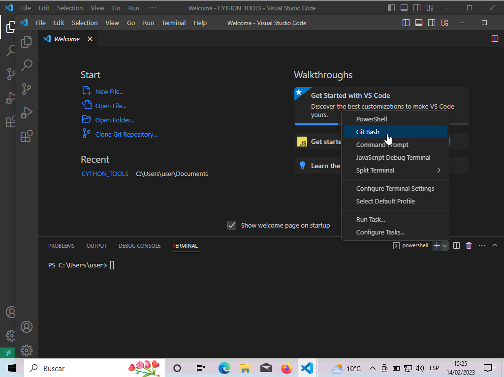
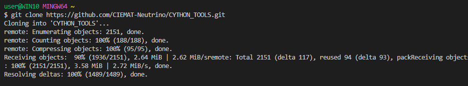
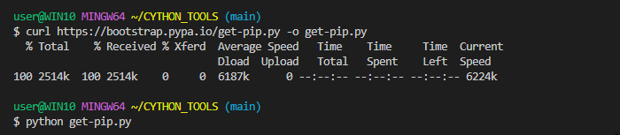
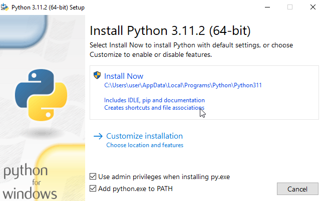
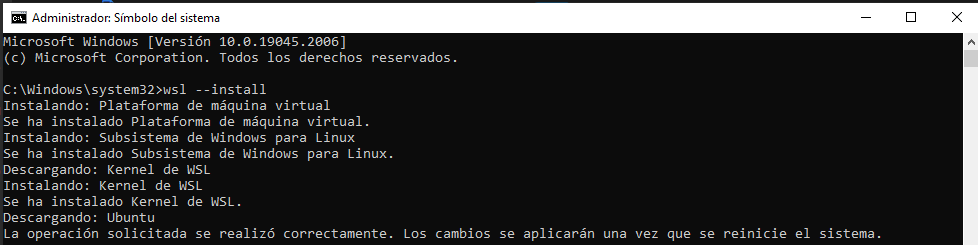

# 🪄 **RUN EVERYWHERE** 

The recommended work-flow is to run the macros from `gaeuidc1.ciemat.es` (connecting by `ssh`). If this is not possible you can run the macros from `gaejupyter` or from your local computer. In this section we explain how to do it.

## GAEJUPYTER 🌐

It is possible to run from any **browser** with a CIEMAT tool, you only need a `afs` user.

Type in your browser:
```
https://gaejupyter.ciemat.es/
```


And introduce your `afs` credentials. You will access to a launcher from which you can use terminals or jupyter notebooks as usual.



Open a terminal and insert the following commands:

1. Select the path directory you see on the left sidebar:
```
cd /home/nfs/user/**yourafsuser**
```

2. Clone the repository in your folder:

Go to your home directory `cd /home/nfs/user/**yourafsuser**` and run

```
git clone https://github.com/CIEMAT-Neutrino/SCINT.git
```
This way, we clone the repository to a location where you can move through the files (the `SCINT` folder should appear in the sidebar). 

If is not the first time you are using the macros make sure you are using the last version and run:
```
git fetch
git reset --hard HEAD
git pull
```
⚠️ This will RESET ALL YOUR local changes ⚠️ and get the last version of the main branch of the repository.

2. Setup the virtual environment and install the needed packages to run the macros:
```
cd SCINT
source setup.sh
```
You should activate it each time you log in and want to use the python version installed there with `source /home/nfs/user/**yourafsuser/SCINT/.venv/bin/activate`, whenever you want to deactivate it and run `deactivate`.


4. Everything is prepared to run the macros and for that you can follow the structure that follows:
```
cd srcs/macros
python3 XXmacro.py (--flags input)
```


In the input file you should introduce the information of the runs you want to analyze:

```bash
# Do not use spaces " " except between KEYWORD and input variables
# If input variables are a list, use "," as a separator
########################
####   DAQ INFO     ####
########################
TYPE: ADC
MODEL: 5725S
BITS: 16384
DYNAMIC_RANGE: 2
SAMPLING: 4e-9
########################
####   RUNS INFO    ####
########################
RAW_DATA: DAT
RAW_PATH: data/BASIC/raw
NPY_PATH: data/BASIC/${USER}/npy
OUT_PATH: data/BASIC/${USER}

OV_LABEL: OV1,0V2,0V3
CALIB_RUNS: 01
LIGHT_RUNS: 09
NOISE_RUNS: 17,128
ALPHA_RUNS: 25
MUONS_RUNS: 29
CHAN_LABEL: SiPM0,SiPM1,SC
CHAN_TOTAL: 0,1,6
CHAN_POLAR: -1,-1,1
CHAN_AMPLI: 250,250,1030
########################
####   BRANCH INFO  ####
########################
#PRESETS USED: 0,  1,  2,  3,  4,  5,  6
LOAD_PRESET: NON,RAW,ANA,ANA,CAL,EVA,ANA
SAVE_PRESET: NON,RAW,ANA,CAL,CAL,NON,DEC
########################
####  CHARGE INFO   ####
########################
TYPE: ChargeAveRange,ChargePedRange,ChargeRange
REF: AveWvf
I_RANGE: 0.1,0.1,0.1,0.1,0.1
F_RANGE: 0.4,0.9,1.9,2.9,3.9
PED_KEY: PreTriggerMean
########################
####   CUTS INFO    ####
########################
#0CUT_CHAN: 0
#0CUT_TYPE: cut_df
#0CUT_KEYS: AnaValleyAmp
#0CUT_LOGIC: bigger
#0CUT_VALUE: 0
#0CUT_INCLUSIVE: False
```

## LOCAL COMPUTER 💻

### Linux 
All the previous instructions are based on a Linux operating system. In summary to run the macros you will need to type:

```bash
cd srcs/macros
python3 XXmacro.py (--flags input)
```

### MacOS

You need to install the sshfs command ([link](https://www.petergirnus.com/blog/how-to-use-sshfs-on-macos)) and adapt the installation commands from linux to your system. Everything else should work as in Linux.

### Windows
The procedure is very similar, here we summarize the principal steps to follow:

0. Install [Git](https://git-scm.com/download/win) (to clone the repo)

1. Clone the repository:

* OPTION#1
> Open command palette
>
> Type clone (git)
>
> Introduce the direction of the repository (https://github.com/CIEMAT-Neutrino/SCINT.git) 
>
> Choose the folder to allocate the repository and open


* OPTION#2
> From the TOOL_BAR select _Terminal_
>
> Open a new one  and select the `+v ` bottom
>
> Choose ` Git Bash` and run
>
> 
>
>    ```bash
>    git clone https://github.com/CIEMAT-Neutrino/SCINT.git
>    cd SCINT
>    code .
>    ```
> 


2. Install python,pip3 [Install the recommended extensions for Python (VSCode suggestions)]

```bash
curl https://bootstrap.pypa.io/get-pip.py -o get-pip.py
python --version
```
      
`OUTPUT --> Python X.XX.X`

```bash
python -m pip install --upgrade pip
```




* Open cmd as administrator + VSCode WSL Extensions

```bash
wsl --install
```




* Ideally with ` wsl ` you can open VS (` code . `) and run the commands as in Linux. You need to check that `ssh` and `sshfs` commands work correctly and if not, install them.