# 🚀 **INTRODUCTION**

This is a python library to process and analyze raw data from the lab. The design objectives were:

* To have a **classless** structure. We store in **dictionaries** all the run/ch information + the waveforms.
* Avoid as much overcalculation as possible, in particular:
  * Calculate pedestal/charge/time values all at once and store them separately from the raw data.
  * Prevent excessive memory usage when dealing with multiple runs.
* Avoid **complicated hierarchies** and **commented/uncommented lines** with the same code.
* To have all the functions compatible between them and moreover, that the obtained output is suitable to be used with all the functions.

🧐 **<u> OBJECTIVES </u>**

1. Study the  detector
    * GAIN → Calibration → {CUTS + GAUSSIAN FITS}
    * Data analysis (RAW processing)
    * Characterization → Effective fits, cross-talk, noise, etc.
2. Physics studies
    * Signal deconvolution
    * Physics fits
    * MC simulations
3. Electronics studies

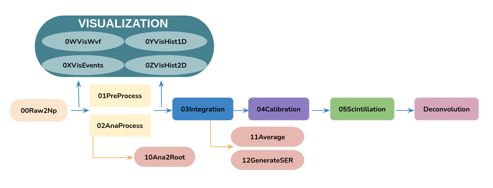

***

## **Getting Started - SETUP**  ⚙️


```{note}
* We recommend to install [VSCode](https://code.visualstudio.com/) as editor. Some useful extensions are: Remote-SSH, Jupyter, vscode-numpy-viewer, **Python Environment Manager**
* Check that you have python installed with a version `>=3.7` by running `python --version`. If you are working locally and you do not have it run `sudo apt-get update` and `sudo apt-get install python3-pip` to start.
```

### 1. Configure your SSH connection

To run the `SCINT` library you will need to work from any `PCAE` at CIEMAT or establish an SSH connection from your laptop.

* Terminal pro-users: `ssh AFS_USER@YOUR_PCAE.ciemat.es` or `ssh AFS_USER@gaeuidc1.ciemat.es`
* VSCode users:
  - Click on the [Remote-SSH](https://code.visualstudio.com/docs/remote/ssh) icon
  - Add new SSH remote connection
  - Type `ssh AFS_USER@gaeuidc1.ciemat.es`
  - Introduce your AFS password
  - Work as usual in the new window that appears
  - You can change your SSH configuration at `.ssh/config`


### 2. Download the library by cloning it from GitHub

```bash
git clone https://github.com/CIEMAT-Neutrino/SCINT.git 
cd SCINT
# code . #[OPTIONAL]: Opens a new window with all the folders inside SCINT for easy coding
```

Please, create a branch for including changes in the library and if everything works as it should you could merge with the main one.

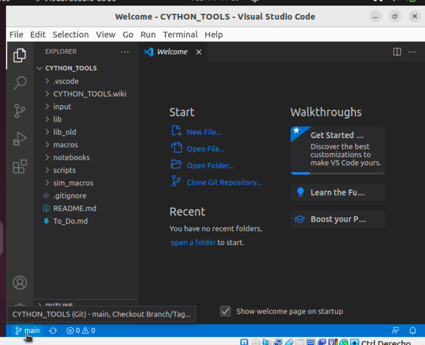

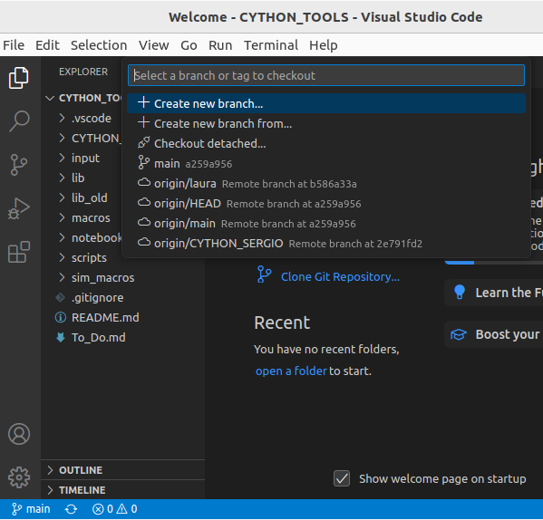

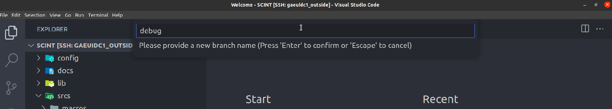

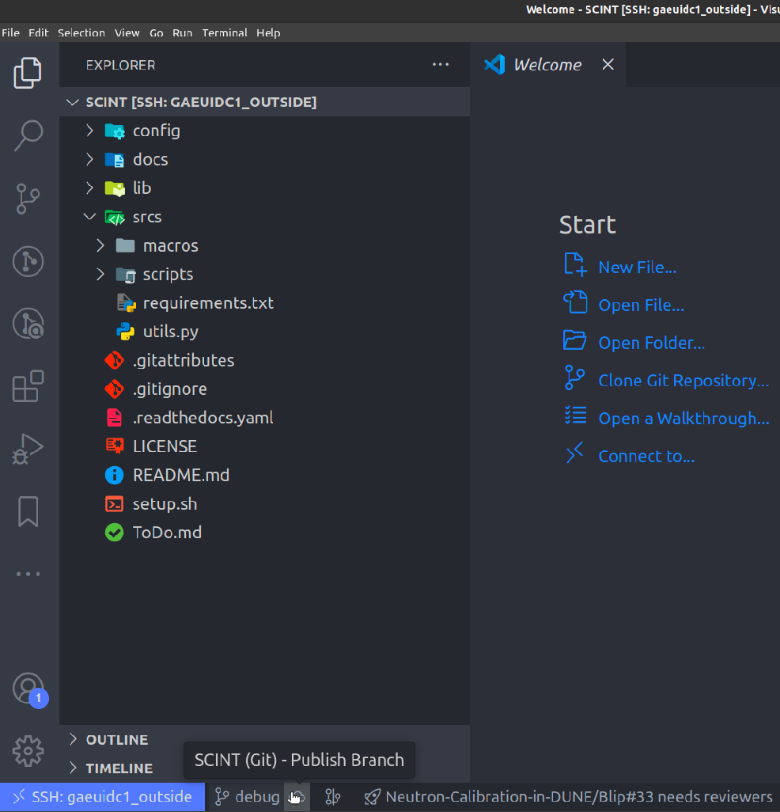


Or run `git checkout -b <your_branch_name>` in a terminal.

**ℹ️ The folder structure you will see is the following ℹ️**

```bash
.
── config
│   ├── FitConfig.yml
│   ├── options.yml
│   ├── input
│   │   ├── MegaCellLArDic23.txt
│   │   ├── MegaCellLArMar24Extr.txt
│   │   ├── MegaCellLArMar24.txt
│   │   └── TUTORIAL.txt
├── docs
│
├── lib
│   ├── __init__.py
│   ├── ana_functions.py
│   ├── cal_functions.py
│   ├── cut_functions.py
│   ├── dec_functions.py
│   ├── fig_config.py
│   ├── fit_functions.py
│   ├── group_functions.py
│   ├── head_functions.py
│   ├── io_functions.py
│   ├── minuit_functions.py
│   ├── ply_functions.py
│   ├── sim_functions.py
│   ├── sty_functions.py
│   ├── unit_functions.py
│   ├── vis_functions.py
│   └── wvf_functions.py
├── src
│   ├── macros
│   │   ├── info
│   │   └── simulation
│   │       ├── 00ProcessScintAndDeco.py
│   │       ├── 01MCScintAndDeco.py
│   │       └── 02VisMCScintAndDeco.py
│   │   ├── 00Raw2Np.py
│   │   ├── 01PreProcess.py
│   │   ├── 02AnaProcess.py
│   │   ├── 03Integration.py
│   │   ├── 04Calibration.py
│   │   ├── 05Scintillation.py
│   │   ├── 06Deconvolution.py
│   │   ├── 0VVisPersistance.py
│   │   ├── 0WVisWvf.py
│   │   ├── 0XVisEvents.py
│   │   ├── 0YVisHist1D.py
│   │   ├── 0ZVisHist2D.py
│   │   ├── 10Ana2Root.py
│   │   ├── 11Average.py
│   │   ├── 11AverageSPE.py
│   │   ├── 12GenerateSER.py
│   │   ├── 13Noise.py
│   ├── scripts
│   │   ├── Dockerfile
│   │   ├── make_python_env.sh
│   │   ├── requirementsTeX.txt
│   │   └── Utils.md
│   ├── requirements.txt
│   └── utils.py
├── LICENSE
├── README.md
├── setup.sh
└── ToDo.md

```

<div style="clear: both;">
  <div style="float: right; margin-left 1em;">
    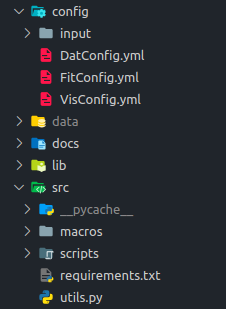
  </div>
  <div>

📂 `config\input` → input `txt` files are stored here, and they are used as input in all the macros (check `TUTORIAL.txt` as template)

📂 `\lib` → all the functions of the library itself are stored here

📂 `\srcs` → macros and scripts subfolders
  - `\macros` → macros to run the analysis. 0i are used for visualizing and 0# are used for processing data (they are sorted to make easy to remember the work-flow)

  - `\scripts` → the scripts are used to configure the needed packages for the library (`make_python_env.sh`), create a Docker image and other utilities
  </div>
</div>

💡 *Recommendation:* It is recommended not to change the content of the `scripts` so that anyone can run the library from scratch with the initial configuration, except to include improvements, of course 💙.

### 3. Install packages needed for the library to run

* Execute the `setup.sh` script that will create a virtual environment to run `SCINT` with all the required packages. It will also generate a symbolic link to a folder were data to follow the tutorial is included.

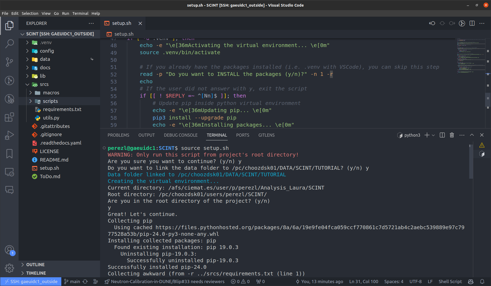

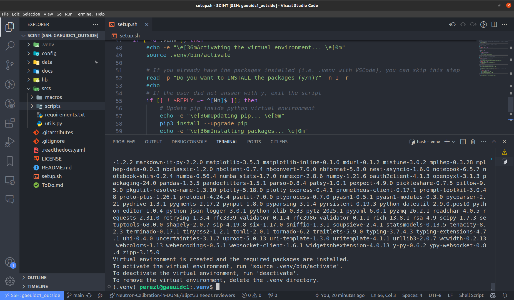

* [Pro-users] You can create the virtual environment by your own:

  - Install VSCode and some extensions: Remote-SSH, Jupyter, vscode-numpy-viewer, **Python Environment Manager**
  - CREATE VIRTUAL ENVIROMENT: **VSCode venv extension**.

    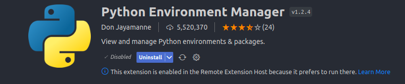

    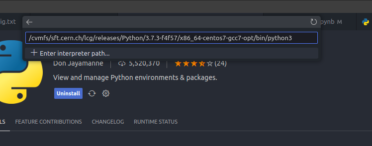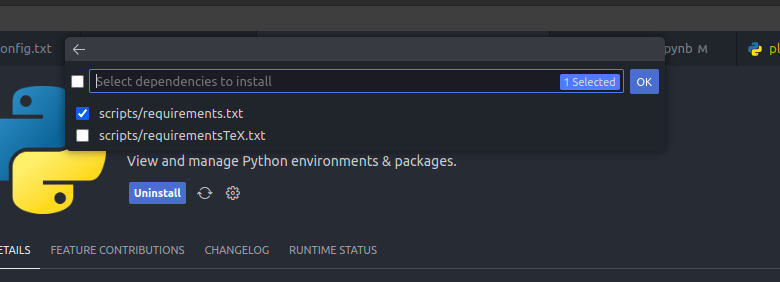

   You need to source a `python` version installed in your computer [*+ Enter interpreter path*]. In `gaeuidc1.ciemat.es` you can source to `/cvmfs/sft.cern.ch/lcg/releases/Python/3.7.3-f4f57/x86_64-centos7-gcc7-opt/bin/python3` (as long as it is `>=3.7`) (Figure 2). Then it will recommend you the ``/srcs/requirements.txt`` packages, and it will automatically install them (Figure 3) :)

    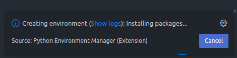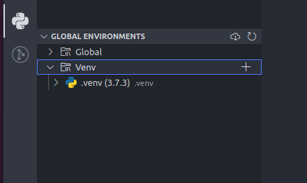
        It will create the environment, and you will be able to see it in the right panel of VSCode (Figure 4). Jupyter notebooks will detect this `.venv` and you can also open terminals and activate it with `source SCINT/.venv/bin/activate`.

  - From the terminal

    ```bash
    mkdir .venv
    cd .venv
    /cvmfs/sft.cern.ch/lcg/releases/Python/3.7.3-f4f57/x86_64-centos7-gcc7-opt/bin/python3 -m venv .
    source bin/activate
    ```

Additionally, if you have `sudo` permissions you can try an installation `requirementsTeX.txt` with `sudo apt install <requirementsTeX.txt` to be able to use LaTeX in the notebooks.