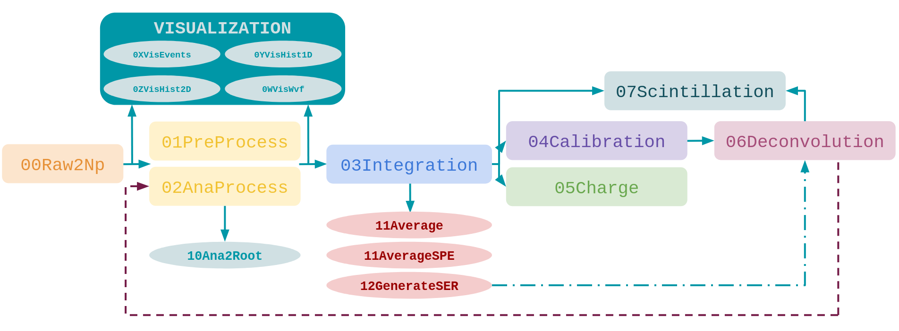
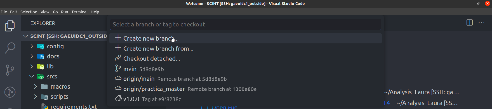
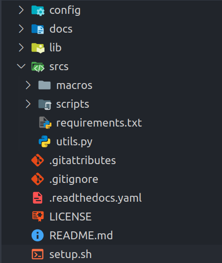

# 🚀 **INTRODUCTION**

This is a python library to process and analyze raw data from the lab. The design objectives were:

* To have a **classless** structure. We store in **dictionaries** all the run/ch information + the waveforms.   
* Avoid as much overcalculation as possible, in particular:
    * Calculate pedestal/charge/time values all at once and store them separately from the raw data.
    * Prevent excessive memory usage when dealing with multiple runs.
* Avoid **complicated hierarchies** and **commented/uncommented lines** with the same code.
* To have all the functions compatible between them and moreover, that the obtained output is suitable to be used with all the functions. 

🧐 **<u> OBJECTIVES </u>** 

1. Study the  detector
    * GAIN → Calibration → {CUTS + GAUSSIAN FITS}
    * Data analysis (RAW processing)
    * Characterization → Effective fits, cross-talk, noise, etc.
2. Physics studies
    * Signal deconvolution
    * Physics fits
    * MC simulations
3. Electronics studies



***

## **Getting Started - SETUP**  ⚙️

If you have never worked with python you need to install it firstly with
```bash
sudo apt-get update
sudo apt-get install python3-pip
```

We recommend to install [VSCode](https://code.visualstudio.com/) as editor. Some useful extensions are: Remote-SSH, Jupyter, vscode-numpy-viewer, **Python Environment Manager**


### 0. Download the library by cloning it from GitHub

```bash
git clone https://github.com/CIEMAT-Neutrino/SCINT.git 
cd SCINT
code .
```

Please, create a branch for including changes in the library and if everything works as it should you could merge with the main one.




or run `git checkout -b <your_branch_name>` in a terminal.

 **ℹ️ The folder structure you will see is the following ℹ️**

<div style="clear: both;">
  <div style="float: right; margin-left 1em;">
     
  </div>
  <div>

📂 `\input` → input txt files are stored here and they are used as input in all the macros (check `TUTORIAL.txt` as template)

📂 `\lib` → all the functions of the library itself are stored here

📂 `\macros` → macros to run the analysis. 0i are used for visualizing and 0# are used for processing data (they are sorted to make easy to remember the work-flow)

📂 `\notebooks` → some useful notebooks for interactive visualization 🙂.

📂 `\scripts` → the scripts are used to configure the needed packages for the library (`copy_data.sh`, `setup.sh`)
  </div>
</div>

💡 *Recommendation:* It is recommended not to change the content of the `scripts` so that anyone can run the library from scratch with the initial configuration (except to include improvements, of course). If you want to reuse any, copy it to a `your_username` or `scratch` folder that would not be updated with git (see  `.gitignore` file). The `notebooks` folder is configured not to be updated so you can freely change them. Again, if you find some improvement you can contact the authors to include them in the templates. 💙

### 1. Install packages needed for the library to run

* **[RECOMENDED] Work with VSCode**:
   - Install VSCode and some extensions: Remote-SSH, Jupyter, vscode-numpy-viewer, **Python Environment Manager**
   - CREATE VIRTUAL ENVIROMENT: **VSCode venv extension**. 


   You need to source a `python` version installed in your computer [*+ Enter interpreter path*]. In `gaeuidc1.ciemat.es` you can source to `/cvmfs/sft.cern.ch/lcg/releases/Python/3.7.3-f4f57/x86_64-centos7-gcc7-opt/bin/python3` (as long as it is `>=3.7`) (Figure 2). Then it will recomend you the ``/scripts/requirements.txt`` packages and it will automatically install them (Figure 3) :)


    It will create the enviroment and you will be able to see it in the right panel of VSCode (Figure 4). Jupyter notebooks will detect this `.venv` and you can also open terminals and activate it with `source SCINT/.venv/bin/activate`.
   
* From CIEMAT computers
    - CREATE you own VIRTUAL ENVIROMENT: 
    ```bash
    mkdir venv_python3.7
    cd venv_python3.7
    /cvmfs/sft.cern.ch/lcg/releases/Python/3.7.3-f4f57/x86_64-centos7-gcc7-opt/bin/python3 -m venv .
    source bin/activate
    ```

### 2. Prepare the library to be run (just the first time)

```bash
cd SCINT/scripts
sh setup.sh
```
To be run from the ``scripts`` folder (it will ask you for confirmation) and it will download the ``notebooks`` folder to make your analysis. 
Additionally, if you have created your own virtual enviroment in a CIEMAT computer you need to install some packages (make sure it is activated) and answer ``y`` to the INSTALL question. If have created the virtual enviroment with the VSCode extension you will have them installed already, answer ``n``.

<!--  -->

Additionally, if you have `sudo` permissions you can try an install `requirementsTeX.txt` with `sudo apt install <requirementsTeX.txt` to be able to use LaTeX in the notebooks.

### 3. Make sure you have access to data to analyse

* **[RECOMENDED] Configure VSCode SSH conection** and work from ``gaeuidc1.ciemat.es`` (you will have access to the data in ``/pc/choozdsk01/palomare/SCINT/folders``)

* Mount the folder with the data in your local machine ``sshfs pcaeXYZ:/pc/choozdsk01/palomare/SCINT/folder ../data`` making sure you have an empty ``data`` folder 📂.

* Copy the data to your local machine. See ``sh scripts/copy_data.sh AFS_USER AFS_PCAE`` for an example on how to copy the ``TUTORIAL`` data.

You need to provide your afs user to access the folder with the raw data which is stored in `/pc/choozdsk01/palomare/SCINT/TUTORIAL/BASIC/` for running the tutorial. Here you will find a run of each type (i.e. calibration SiPM/SC/PMT, noise, laser, alpha and muons). You can also introduce your pcae number otherwise a default configuration will be used.

```{warning}
You are going to download 5,4 GB of data. This command is valid if you are working inside CIEMAT. 
```


The copied data are stored in `/data/TUTORIAL/raw/runXX`. For further analysis you may need to check also in `/pnfs/ciemat.es/data/neutrinos/`.

```{note}
You can change this script to copy locally the data you may need (do not comitt it please 🙏🏽)
Ideally we do not want to work locally so you may need to mount the folder where the data is store (i.e `/pnfs/ciemat.es/data/neutrinos/FOLDER`) for what you need to:  
```bash
sshfs USER@pcaeXYZ.ciemat.es:/pnfs/ciemat.es/data/neutrinos/FOLDER ../data
```
⚠️ Making sure **EMPTY**  `data` folder exists ⚠️ (you will need to change the name of your data folder created by the default configuration built with the setup script)

Once this is done we will find in the following distribution:                                                          

`data/MONTH/raw/runXX`      with the `waveY.dat` files and                                                               

`data/MONTH/npy/runXX_chYY` with `.npz` created. (npz_names=keys of the my_runs dict in the macros' workflow) 

### 4. Have a look on the ``notebooks`` folder to see how to visualize data and run the macros

```bash
cd ../notebooks
juptyer notebook 00TUTORIAL.ipynb
```


Here you can see some visualization examples you can use in your analysis.