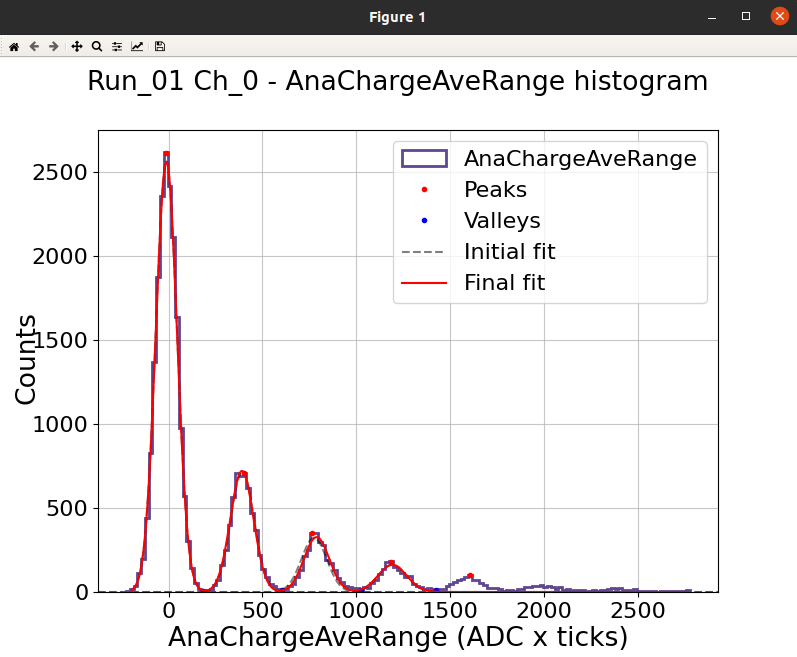
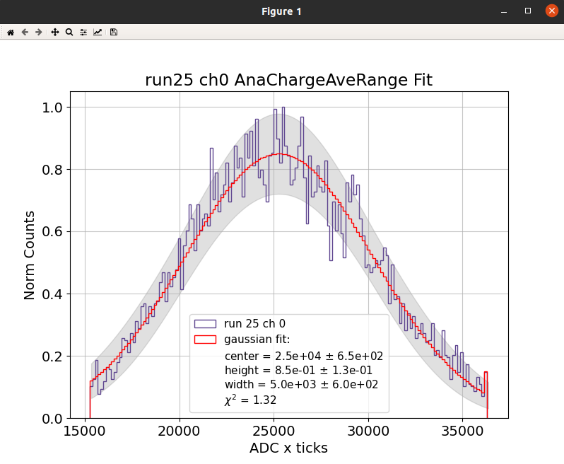

# 🔎 **MACROS** 

## Inputs files
The first step to make the macros work is to configure the `input_file.txt`. The first parameter that macros will require from the user is to select an input file:


The formatting of this file need to be conserved to have read it correctly. Check `io_functions.py->read_input_file()`. You can turn `debug=True` when running the macros to check what is being loaded. You will see different sections:
### DAQ INFO
(In principle this section do not need to be changed.)
```python
TYPE: ADC        # Acquisition system (ADC/OSC)
MODEL: 5725S     # Model used
BITS: 16384      # Dynamic range
DYNAMIC_RANGE: 2 # Dynamic range
SAMPLING: 4e-9   # Sampling: 4ns = 1 bin
```
### RUNS INFO
Here you configure the runs you are going to analyse depending on the data taking.
```python
RAW_DATA: DAT                                 # Type of raw data you are using (DAT/ROOT)
PATH: /pc/choozdsk01/palomare/SCINT/TUTORIAL/ # Path to the data (also ../data/ if you have the data mounted in your local machine)
MONTH: BASIC                                  # Folder where the data is stored
OV_LABEL: OV1,OV2                             # Labels for the different OV runs
CALIB_RUNS: 01,08                             # Calibration runs: trigger+light with pulse generator; laser to single photo electron (SPE) level
LIGHT_RUNS: 09                                # Light runs: trigger+light with pulse generator; laser with more intensity
NOISE_RUNS: 17,128                            # Noise runs: laser OFF + trigger pulse generator, "random trigger".
ALPHA_RUNS: 25                                # Alpha runs: coincidence trigger 2SiPMs; LAr scintillation light with alpha deposition
MUONS_RUNS: 29                                # Muons runs: coincidence trigger 2SiPMs;  LAr scintillation light with muon deposition
CHAN_LABEL: SiPM0,SC                          # Labels for the different channels
CHAN_TOTAL: 0,6                               # ADC channels (wave0.dat, wave6.dat stored raw files)
CHAN_POLAR: -1,1                              # Polarity of the channels (RawADC in SiPMs are negative in this setup)
CHAN_AMPLI: 250,1300                          # Amplification factor for each channel
```

### BRANCH INFO
In this section the presets for loading/saving `*.npz` files are configured. In principle you dont need to change this but check in `io_functions.py -> get_preset_list()` for more info.
```python
#PRESETS USED: 0,  1,  2,  3,  4,  5,  6
LOAD_PRESET: NON,RAW,ANA,ANA,EVA,EVA,ANA
SAVE_PRESET: NON,ALL,EVA,CAL,CAL,NON,DEC
```
###  ANA DEFAULTS
```python
PED_KEY: PreTriggerMean # Key to be used for the pedestal
```

### CHARGE INFO
Here you define integration ranges to get the charge of your signal. There are different calibration modes check `wvf_functions.py -> integrate_wvfs()` for more info.
```python
TYPE: ChargeAveRange,ChargePedRange,ChargeRange # Integration type (ChargeAveRange,ChargeRange*,ChargePedRange*)
REF: AveWvf                                     # Reference average waveform to compute the integration ranges (AveWvf,AveWvfSPE)
I_RANGE: 0.1,0.5,0.5,0.5,0.5                    # Initial integration time (in us) -> ChargeRange0_ini = peak-0.1us
F_RANGE: 0.1,0.5,1.0,2.0,4.0                    # Final integration time (in us)   -> ChargeRange0_end = peak+0.1us
```

### CUTS INFO
If you need to remove some events to perform the analysis you can include some cuts in this section. You can add as many cuts as needed by adding a number to the key (`0CUT`,`1CUT`,`2CUT`...).
```python
0CUT_CHAN: 0,6          # Channels to apply the cut
0CUT_TYPE: cut_df       # Type of cut
0CUT_KEYS: AnaValleyAmp # Keys to apply the cut
0CUT_LOGIC: bigger_than # Logic of the cut
0CUT_VALUE: 0           # Value of the cut (AnaValleyAmp>0 are the events that we want to keep)
0CUT_INCLUSIVE: False   # Inclusive cut (False event need to be in all the channels)
```

## Flags

You can start by running the macros in the `guide` mode and it will ask you for the input variables needed (see an example for the input file)


Once you are sure about the variables to use you can run the macro with the defined flags:
```python
-h or --help
-i or --input_file
-l or --load_preset
-s or --save_preset
-k or --key
-v or --variables
-r or --runs
-c or --channels
-f or --filter
-d or --debug
```

They may be useful when you do not need to run a macro over all the runs or channels configured in the input file. For example, if you want to run the macro `00Raw2Np.py` only for the runs 1 and 2 and channels 0 and 1 you can run:
```bash
python3 00Raw2Np.py -r 1,2 -c 0,1
```

## Analysis Macros
You will see that the macros start with the ssome of these common lines:
```python
import sys; sys.path.insert(0, '../'); from lib import *
default_dict = {"runs":["CALIB_RUNS","LIGHT_RUNS","ALPHA_RUNS","MUONS_RUNS","NOISE_RUNS"],"channels":["CHAN_TOTAL"],"key":["ANA_KEY"]}
user_input = initialize_macro("00Raw2Np",["input_file","debug"],default_dict=default_dict, debug=True)
info = read_input_file(user_input["input_file"][0], debug=user_input["debug"])
```
which imports all the funcions of the library (from `lib` folder) to be used and define the default values that each macro need to work. Also, the user input is initialized with the `initialize_macro` function. The first argument is the name of the macro, the second is the list of arguments that the macro needs to work and the third is the default values for the arguments.

### 00Raw2Np
This macro converts the raw files, usually `*.dat`, from `/data/MONTH/raw` into `.npz` files at `/data/MONTH/npy`. It is using the `binary2npy()` function. Notice that once you run this macro you will have a new folder `/data/MONTH/npy/runXX_chYY` where the `*.npz` files are stored. 

```python
binary2npy(np.asarray(user_input["runs"]).astype(int),np.asarray(user_input["channels"]).astype(int),user_input=user_input,compressed=True,force=True)
```

⏩ **RUN** (in `macros` folder) ⏩
```bash
python3 00Raw2Np.py
```

✅ If everything is OK you should get new folders `/npy/runXX_chYY`


where we see the destination file and if the different files existed previously, are overwritten etc...


### 01PreProcess <a ID="pre-process"></a>

This macro will process the {RawPedestal, RawPeak} variables for the RawADC that are computed and saved in .npz files. You will see as terminal output the saved files. By default the saving is set to force = True and so if you pre-process files that already existed they will be overwritten. 


```python
for run, ch in product(np.asarray(user_input["runs"]).astype(int),np.asarray(user_input["channels"]).astype(int)):
    my_runs = load_npy([run],[ch], info, preset=info["LOAD_PRESET"][1], compressed=True, debug=user_input["debug"])
    
    compute_peak_variables(my_runs, key=user_input["key"][0], label="", debug=user_input["debug"])
    compute_pedestal_variables(my_runs, key=user_input["key"][0], label="", debug=user_input["debug"]) # Checking the best window in the pretrigger

    delete_keys(my_runs,[user_input["key"][0]]) # Delete previous peak and pedestal variables
    save_proccesed_variables(my_runs, info, preset=info["SAVE_PRESET"][1], force=True, debug=user_input["debug"])
    
    del my_runs
    gc.collect()

```

⏩ **RUN** (in `macros` folder) ⏩
```bash
python3 01PreProcess.py
```


### 02AnaProcesss <a ID="process"></a>

This macro will process the {Pedestal, Peak} variables for the ADC are computed and saved in .npz files. You will see as terminal output the saved files. By default the saving is set to force = True and so if you pre-process files that already existed they will be overwritten. However, we delete the RawKeys from the my_runs dictionary to save computing time (RawInfo don’t change).

```python
for run, ch in product(np.asarray(user_input["runs"]).astype(int),np.asarray(user_input["channels"]).astype(int)):
    my_runs = load_npy([run],[ch], info, preset=info["LOAD_PRESET"][2], compressed=True, debug=user_input["debug"])
    compute_ana_wvfs(my_runs,debug=False)
    delete_keys(my_runs,['RawADC','RawPeakAmp', 'RawPeakTime', 'RawPedSTD', 'RawPedMean', 'RawPedMax', 'RawPedMin', 'RawPedLim']) # Delete branches to avoid overwritting

    compute_peak_variables(my_runs, label="Ana", key="AnaADC", debug=user_input["debug"])     # Compute new peak variables
    compute_pedestal_variables(my_runs, label="Ana", key="AnaADC", debug=user_input["debug"]) # Compute new ped variables using sliding window

    save_proccesed_variables(my_runs,preset=str(info["SAVE_PRESET"][2]),info=info, force=True)
    del my_runs
    gc.collect()
```

⏩ **RUN** (in `macros` folder) ⏩
```bash
python3 02Process.py
```


### 03Integration <a ID="integration"></a>
In this macro we compute the charge (example: `integrate_wvfs(my_runs, ["ChargeAveRange"], "AveWvf", ["DAQ", 250], [0,100])`)
```python  
 for run, ch in product(np.asarray(user_input["runs"]).astype(int),np.asarray(user_input["channels"]).astype(int)):
    my_runs = load_npy([run],[ch], info, preset=info["LOAD_PRESET"][3], compressed=True, debug=user_input["debug"])
    
    integrate_wvfs(my_runs, info=info, key=user_input["key"][0], debug=user_input["debug"])

    delete_keys(my_runs,user_input["key"])
    save_proccesed_variables(my_runs, preset=str(info["SAVE_PRESET"][3]),info=info, force=True, debug=user_input["debug"])
    del my_runs
    gc.collect()
```
It will be used for calibrating the sensors in the following macro.

⏩ **RUN** (in `macros` folder) ⏩
```bash
python3 03Integration.py
```


### 04Calibration <a ID="calibration"></a>

Compute a calibration histogram where the peaks for the PED/1PE/2PE... are fitted to obtain the gain. 

```python
 for run, ch in product(np.asarray(user_input["runs"]).astype(int),np.asarray(user_input["channels"]).astype(int)):
    my_runs = load_npy([run],[ch], info, preset=info["LOAD_PRESET"][4], compressed=True, debug=user_input["debug"])

    label, my_runs = cut_selector(my_runs, user_input)
    popt, pcov, perr = calibrate(my_runs,[user_input["variables"][0]],OPT, debug=user_input["debug"])
    calibration_txt(run, ch, popt, pcov, filename="gain", info=info, debug=user_input["debug"])
```

The parameters are computed from the best fit parameters and covariance matrix obtained from the curve_fit function. These parameters are saved in a txt for each channel.

With the cuts functions we also compute the SPE waveform (that can be visualized with the Vis macros)

⏩ **RUN** (in `macros` folder) ⏩
```bash
python3 04Calibration.py
```


If everything is working as it should you should obtain the following histograms (raw and fitted) and a txt file with the calibration parameters (if confirmed when asked through terminal) ✅




### 05Scintillation <a ID="scintillation"></a>

```python

    ## Visualize average waveforms by runs/channels ##
    my_runs = load_npy(runs.astype(int),channels.astype(int),branch_list=["Label","Sampling","AveWvf"],info=info,compressed=True) #Remember to LOAD your wvf
    vis_compare_wvf(my_runs, ["AveWvf"], compare="RUNS", OPT=OPT)

    for run, ch in product(runs.astype(int),channels.astype(int)):
        my_runs = load_npy([run],[ch], branch_list=["ADC","TimeStamp","Sampling","ChargeAveRange", "NEventsChargeAveRange","AveWvf"], info=info,compressed=True)  #preset="ANA"
        print_keys(my_runs)

        ## Integrated charge (scintillation runs) ##
        print("Run ", run, "Channel ", ch)

        popt_ch = []; pcov_ch = []; perr_ch = []; popt_nevt = []; pcov_nevt = []; perr_nevt = []
        popt, pcov, perr = charge_fit(my_runs, int_key, OPT); popt_ch.append(popt); pcov_ch.append(pcov); perr_ch.append(perr)
        
        scintillation_txt(run, ch, popt_ch, pcov_ch, filename="pC", info=info) ## Charge parameters = mu,height,sigma,nevents ## 

```

⏩ **RUN** (in `macros` folder) ⏩
```bash
python3 05Scintillation.py
```




If everything is working as it should you should obtain the following histograms (raw and fitted) and a txt file with the scintillation parameters (if confirmed when asked through terminal) ✅

### 06Deconvolution <a ID="deconvolution"></a>
🚧 ... updating ... 🚧

Before runing the deconvolution macro make sure you have a clean laser/led signal that can be used as a template. The macro will load the alpha runs and rescale the light signal to the SPE amplitude according to AveWvfSPE calculated at calibration stage.

 - Firstly, the average wvfs are deconvolved. From these the gauss filter cut-off (from the wiener filter fit) is extracted and saved.
 - Secondly, the previous calculated gauss filter is applied to deconvolve the ADC wvfs.
 - Finally, the deconvolved wvfs are saved for further process using the standard workflow.  

```python
for idx, run in enumerate(raw_runs):
    for jdx, ch in enumerate(ana_ch):
        my_runs = load_npy([run],[ch],preset=str(info["LOAD_PRESET"][6]),info=info,compressed=True)  # Select runs to be deconvolved (tipichaly alpha)     

        if "SiPM" in str(my_runs[run][ch]["Label"]):
            light_runs =  load_npy([dec_runs[SiPM_OV]],[ch],preset="EVA",info=info,compressed=True) # Select runs to serve as dec template (tipichaly light)    
            single_runs = load_npy([ref_runs[SiPM_OV]],[ch],preset="EVA",info=info,compressed=True) # Select runs to serve as dec template scaling (tipichaly SPE)   
        elif "SC" in str(my_runs[run][ch]["Label"]):
            light_runs =  load_npy([dec_runs[idx]],[ch],preset="EVA",info=info,compressed=True) # Select runs to serve as dec template (tipichaly light)    
            single_runs = load_npy([ref_runs[idx]],[ch],preset="EVA",info=info,compressed=True) # Select runs to serve as dec template scaling (tipichaly SPE)
        else:
            print("UNKNOWN DETECTOR LABEL!")
        
        keys = ["AveWvf","SER","AveWvf"] # keys contains the 3 labels required for deconvolution keys[0] = raw, keys[1] = det_response and keys[2] = deconvolution 

        generate_SER(my_runs, light_runs, single_runs)

        OPT = {
            "NOISE_AMP": 1,
            "FIX_EXP":True,
            "LOGY":True,
            "NORM":False,
            "FOCUS":False,
            "SHOW": True,
            "SHOW_F_SIGNAL":True,
            "SHOW_F_GSIGNAL":True,
            "SHOW_F_DET_RESPONSE":True,
            "SHOW_F_GAUSS":True,
            "SHOW_F_WIENER":True,
            "SHOW_F_DEC":True,
            "WIENER_BUFFER": 800,
            "THRLD": 1e-4,
            }

        deconvolve(my_runs,keys=keys,OPT=OPT)

        OPT = {
            "SHOW": False,
            "FIXED_CUTOFF": True
            }

        keys[0] = "ADC"
        keys[2] = "ADC"
        deconvolve(my_runs,keys=keys,OPT=OPT)

        save_proccesed_variables(my_runs,preset=str(info["SAVE_PRESET"][6]),info=info,force=True)
        del my_runs,light_runs,single_runs

generate_input_file(input_file,info,label="Gauss")

```

⏩ **RUN** (in `macros` folder) ⏩
```bash
python3 06Deconvolution.py
```


## Visualizing Macros

All the visualizing macros use the `VisConfig.txt` stored in the `macros` folder. This file contains the default values for the visualization. You can change the values in the file or when running the macro (it will show you the loaded values and ask the user if need to change a line).
```python
MICRO_SEC: True            # True if you want to see the time in microseconds
NORM: False                # True if you want to normalize the waveforms
LOGX: False                # True if you want to see the x axis in log scale
LOGY: False                # True if you want to see the y axis in log scale
LOGZ: False                # True if you want to see the z axis in log scale
CHARGE_KEY: ChargeAveRange # Key to be used for the charge 
CHARGEDICT: False          #
PEAK_FINDER: False         #
CUTTED_WVF: 0              # To show all the events (-1), the cutted (0) or the uncutted (1)
LEGEND: False              # True if you want to see the legend
THRESHOLD: 1               # NORMALIZED Threshold for the peak finder (calibration fit)
WIDTH: 15                  # NORMALIZED Width for the peak finder (calibration fit)
PROMINENCE: 0.4            # NORMALIZED Prominence for the peak finder (calibration fit)
ACCURACY: 1000             # NORMALIZED Accuracy for the peak finder (calibration fit)
SHOW_AVE: AveWvf           # Average waveform to be shown if computed (AveWvf,AveWvfSPE,...)
SHOW_PARAM: True           # True if you want to see the parameters of the fit
SHOW: True                 # True if you want to see the plot
COMPARE: NONE              # Comparissons in the same plot (NONE, RUNS, CHANNELS)
TERMINAL_MODE: True        # True if you want to see the plot in the terminal
PRINT_KEYS: False          # True if you want to print the keys of the dictionary
SCINT_FIT: True            # True if you want to fit the scintillation peaks
```

### 0XVisEvent <a ID="visevent"></a>

We can visualize the individual events from the moment we pre-process the waveforms and obtain RawInfo.

```python
my_runs = load_npy(np.asarray(user_input["runs"]).astype(int),np.asarray(user_input["channels"]).astype(int),preset=user_input["load_preset"][0],info=info,compressed=True) # preset could be RAW or ANA
label, my_runs = cut_selector(my_runs, user_input, debug=user_input["debug"])
vis_npy(my_runs, user_input["key"],OPT=OPT) # Remember to change key accordingly (ADC or RawADC)
```

⏩ **RUN** (in `macros` folder) ⏩
```bash
python3 0XVisEvent.py -r 1 -c 0,6
[?] select input file  [flag: -i]: TUTORIAL
[?] select load_preset [flag: -l]: ANA    (or RAW)
[?] select key         [flag: -k]: AnaADC (or RawADC)
```


The individual events of different channels can be visualized together and with AveWvf superposed.

<!-- This macro could be used to visualize histograms (with/without applying cuts). In the following picture you can see different options (not all at the same time):

:::{tip} 
1. Make the zoom you need with the 🔍
2. This will add one point you need to delete with the **right bottom** of your mouse
3. Select the area you want to keep by adding points with the **left bottom**
4. When you are ready click on the **mouse wheel** to confirm your selection
::: -->

### 0YVisHist1D <a ID="vishist1d"></a>
```python
my_runs = load_npy(np.asarray(user_input["runs"]).astype(int), np.asarray(user_input["channels"]).astype(int), preset="EVA", info=info, compressed=True) # preset could be RAW or ANA
label, my_runs = cut_selector(my_runs, user_input, debug=user_input["debug"])
vis_var_hist(my_runs, user_input["variables"], percentile = [0.1, 99.9], OPT = OPT, select_range=False, debug=user_input["debug"])
```

⏩ **RUN** (in `macros` folder) ⏩
```bash
python3 0YVisHist1D.py -r 1 -c 0,6
[?] select input file  [flag: -i]: TUTORIAL
[?] select variables   [flag: -v]: AnaPeakTime (or the key we want to plot that is already computed)
```


### 0ZVisHist2D <a ID="vishist2d"></a>
```python
my_runs = load_npy(np.asarray(user_input["runs"]).astype(int), np.asarray(user_input["channels"]).astype(int), preset="EVA",info=info,compressed=True) # preset could be RAW or ANA
label, my_runs = cut_selector(my_runs, user_input, debug=user_input["debug"])
vis_two_var_hist(my_runs, user_input["variables"], OPT = OPT, percentile=[0.1,99.9], select_range=False)
```

⏩ **RUN** (in `macros` folder) ⏩
```bash
python3 0ZVisHist2D.py -r 1 -c 0,6
[?] select input file  [flag: -i]: TUTORIAL
[?] select variables   [flag: -v]: AnaPeakAmp,AnaChargeAveRange (or the key we want to plot that is already computed)
```

<!--  -->


### 0WVisWvf
```python
my_runs = load_npy(np.asarray(user_input["runs"]).astype(int),np.asarray(user_input["channels"]).astype(int), info, preset=user_input["load_preset"][0], compressed=True, debug=user_input["debug"])
vis_compare_wvf(my_runs, user_input["variables"], OPT=OPT)
```

⏩ **RUN** (in `macros` folder) ⏩
```bash
python3 0WVisWvf.py -r 1 -c 0,6
[?] select input file  [flag: -i]: TUTORIAL
[?] select variables   [flag: -v]: AnaPeakAmp,AnaChargeAveRange (or the key we want to plot that is already computed)
```

<!--  -->


### 0VVisPersistence
```python
my_runs = load_npy(np.asarray(user_input["runs"]).astype(int),np.asarray(user_input["channels"]).astype(int), info, preset=user_input["load_preset"][0], compressed=True, debug=user_input["debug"])
vis_persistence(my_runs)
```

⏩ **RUN** (in `macros` folder) ⏩
```bash
python3 0VVisPersistence.py -r 1 -c 0
[?] select input file   [flag: -i]: TUTORIAL
[?]  select load_preset [flag: -l]: ANA

## We recomend to cut some events to see the persistence ##
[?] Select channels for applying **cut_df**: 0
[?] Select key for applying **cut_df**: AnaValleyAmp
[?] Select logic for applying **cut_df**: bigger
[?] Select value for applying **cut_df**: 0
[?] Select inclusive for applying **cut_df**: False
```

