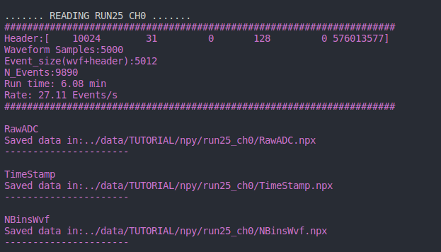
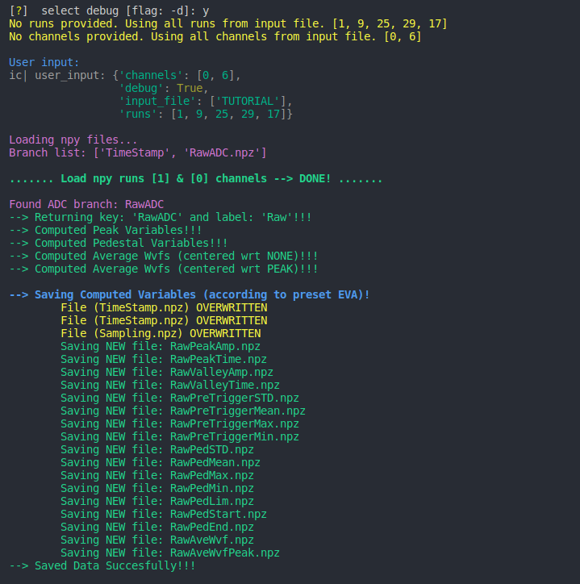
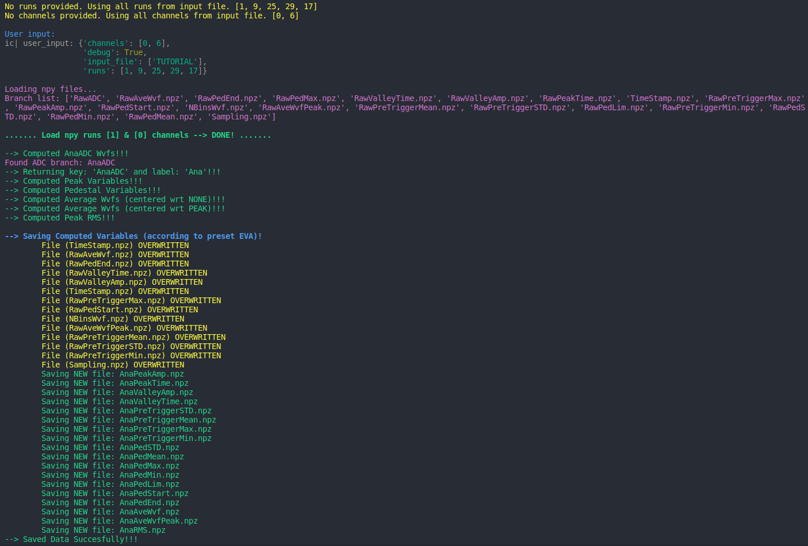

.. _notebook:

📋 EXAMPLES
===========

If you are interested in the examples probably you have alredy cloned the repository into a local directory (and you are ready to start). 

You can also see this examples and run them locally in ``notebooks/00TUTORIAL.ipynb``

If you are **not** working from `gaeuidc1.ciemat.es` you will need to download the data (or work with a mounted folder) into an EMPTY folder ``data`` 📂.

.. code-block:: bash

   cd macros
   python3 00Raw2Np.py     (-i TUTORIAL -d y)

.. code-block:: bash

   python3 01PreProcess.py (-i TUTORIAL -d y)

With this step we will have all the **RAW** variables computed (including a **RawAveWvf**) and you can alredy visualize them to see that everything is OK. 

.. code-block:: bash

   python3 02Process.py    (-i TUTORIAL -d y)

With this step we will have all the **ANA** variables computed (including a **AnaAveWvf**), meaning that the waveforms have the baseline at 0 and have positive polarity.

Once the data is process we can start visualizing it. Once you understand the code try to run it locally with our TUTORIAL dataset.

.. toctree::
   :maxdepth: 1

   vis_check
   vis_event
   vis_wvfs
   vis_noise
   vis_histo
   vis_cuts