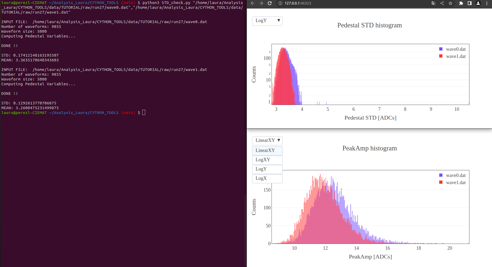

==============================
Pre-analysis checks
==============================

Here we show an example of the plots produced to monitorize the setup noise parameters. 
For that purpose we can use the ``STD_check.py`` macro, which is independent of the library (i.e. you can download it and run it locally).
To run you must call the macro and as first argument the ``<path+filename>`` of the file(s) you want to analyse. If more than one file is to be analysed you need to separate the ``<path+filename>`` by commas as shown in the following commands:

.. code-block:: python

    (if pcae177 run before: source /data/WaveDumpData/SBND_XA_PDE/CYTHON_TOOLS/joython/my_env/bin/activate )
    python3 STD_check.py "PATH/FILE_NAME1.dat"
    python3 STD_check.py "PATH/FILE_NAME1.dat","PATH/FILE_NAME2.dat"

The plots are configured to be dynamical, meaning that you can zoom in/out, change the scale of the axis, hide any of the legend's variable, save as .png etc.
Firstly, you can find an histogram for the ``Pedestal STD``

.. .. plotly::
      
..       import plotly.express
..       plotly.io.read_json('vis_check1.1.json')

.. plotly::
      
      import plotly.express
      plotly.io.read_json('vis_check1.2.json')

and secondly, an histogram for the ``Peak Amplitude``.

.. .. plotly::
      
..       import plotly.express
..       plotly.io.read_json('vis_check2.1.json')

.. plotly::
      
      import plotly.express
      plotly.io.read_json('vis_check2.2.json')