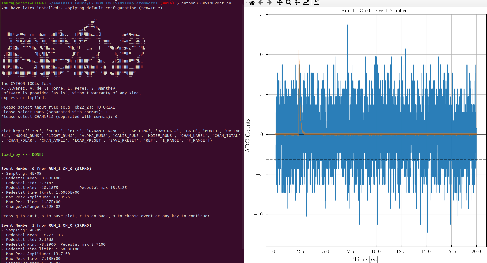

==============================
Individual event visualization
==============================

Here we show an example on how to plot the individual events of a given run. 
We have two options for doing this:

1. Running ``0XVisEvents.py`` macro with the following configuration:

.. code-block:: python
   
   python3 0XVisEvent.py -r 1 -c 0
   [?] select input file  [flag: -i]: TUTORIAL
   [?] select load_preset [flag: -l]: ANA    (or RAW)
   [?] select key         [flag: -k]: AnaADC (or RawADC)

The ``vis.npy`` function will plot the individual events for the ``AnaADC`` key (i.e. processed waveforms).

We can also introduce more than 1 channel in which case we will see them simultaneously.

.. code-block:: python
   
   python3 0XVisEvent.py -r 1 -c 0,6
   [?] select input file  [flag: -i]: TUTORIAL
   [?] select load_preset [flag: -l]: ANA    (or RAW)
   [?] select key         [flag: -k]: AnaADC (or RawADC)

------------

2. The second option is using the ``0XVisEvents.ipynb`` notebook. Here you can see an static option (analogous to the output obtained with the macro) and an interactive option displayed below.

.. plotly::
      
      import plotly.express
      plotly.io.read_json('event.json')