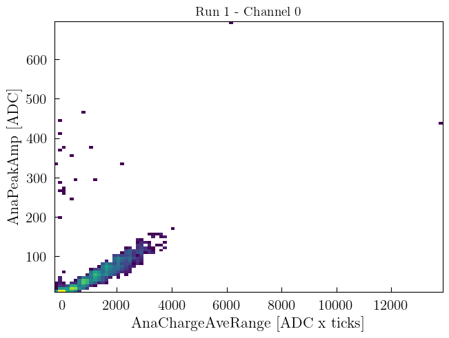

==============================
Histograms visualization
==============================

Here we show an example on how to plot histograms.

.. plotly::
      
      import plotly.express
      plotly.io.read_json('hist1d.json')

