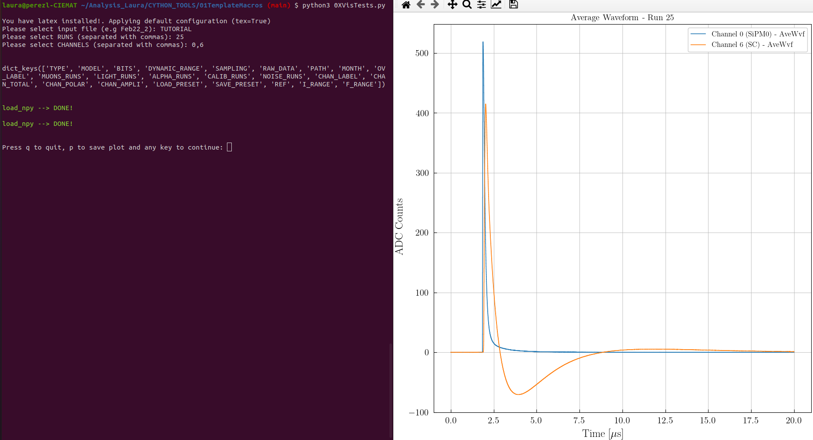

===================================
Waveform comparisson visualization
===================================

In a similar way as we did with the individual events, we can visualize and moreover compare the average waveforms.
This is done with the ``0WVisWvfs.py`` where you can choose between ``compare = "RUNS"/"CHANNELS``.

You can also see an example for comparing waveforms in the ``0WVisWvfs.ipynb`` notebook.

.. plotly::
      
      import plotly.express
      plotly.io.read_json('alpha.json')